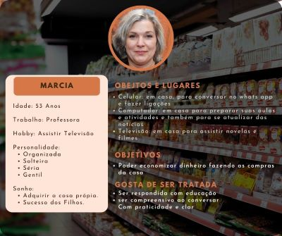

# Informações do Projeto
`TÍTULO DO PROJETO`  

Melhor Preço

`CURSO` 

Ciência da computação

## Participantes

Os membros do grupo são:

* Henrique Temponi Maia
* Jerson Vitor de Paula Gomes
* João Paulo de Castro Markiewicz
* Lucas Randazzo
* Wallace Freitas Oliveira

# Estrutura do Documento

- [Informações do Projeto](#informações-do-projeto)
  - [Participantes](#participantes)
- [Estrutura do Documento](#estrutura-do-documento)
- [Introdução](#introdução)
  - [Problema](#problema)
  - [Objetivos](#objetivos)
  - [Justificativa](#justificativa)
  - [Público-Alvo](#público-alvo)
- [Especificações do Projeto](#especificações-do-projeto)
  - [Personas e Mapas de Empatia](#personas-e-mapas-de-empatia)
  - [Histórias de Usuários](#histórias-de-usuários)
  - [Requisitos](#requisitos)
    - [Requisitos Funcionais](#requisitos-funcionais)
    - [Requisitos não Funcionais](#requisitos-não-funcionais)
  - [Restrições](#restrições)
- [Projeto de Interface](#projeto-de-interface)
  - [User Flow](#user-flow)
  - [Wireframes](#wireframes)
- [Metodologia](#metodologia)
  - [Divisão de Papéis](#divisão-de-papéis)
  - [Ferramentas](#ferramentas)
  - [Controle de Versão](#controle-de-versão)
- [**############## SPRINT 1 ACABA AQUI #############**](#-sprint-1-acaba-aqui-)
- [Projeto da Solução](#projeto-da-solução)
  - [Tecnologias Utilizadas](#tecnologias-utilizadas)
  - [Arquitetura da solução](#arquitetura-da-solução)
- [Avaliação da Aplicação](#avaliação-da-aplicação)
  - [Plano de Testes](#plano-de-testes)
  - [Ferramentas de Testes (Opcional)](#ferramentas-de-testes-opcional)
  - [Registros de Testes](#registros-de-testes)
- [Referências](#referências)

# Introdução
Imagine-se no seguinte cenário, você acabou de receber o salário e decide ir ao mercado realizar a sua compra mensal, enquanto seleciona os itens de seu carrinho é supreendido por um funcionário alterando o preço de um produto que acaba de pega, tudo certo é uma caracterisca comum do mercado, exceto pelo fato que aquele mesmo item já havia sido remarcado mais cinco vezes naquele dia. Esse cenário hipotético pode parecer absurdo para os mais jovens, no entanto, os que viveram o final da década de 80 se lembram bem.

A hiperinflação brasileira foi um enorme problema político-econômico vivenciado pela população brasileira na década 80, a inflação acumulada já estava na casa do milhões e o poder de compra era reduzido pela metada a cada dia. Uma ida rapida ao mercado era motivo de trauma, já que os preços eram atualizados uma, duas, três ou mais vezes no mesmo dia, tornando os mercados um verdadeiro campo de batalha dos brasileiros em busca de aproveitar as ofertas, afim de garantir ao menos o essencial com o pouco dinheiro que ainda lhe restavam no bolso.

Esse clima de pânico foi substituído pelo alívio de poder saber exatamente o quanto gastaria no mercado, criado após a melhora econômica proporcionada com implementação do Plano Real (1994). No entanto, nos ultimos anos, alguns acontecimentos tem nos levado a relembrar desse período caotico, seja nos protestos de 2014, na greve dos caminhoneiros (2018) e agora mais recente na pandemia da COVID-19 (2020-21) seguida pela alta generalizada dos preços dos combustíveis e commodities agrícolas em consequência da Guerra da Ucrânia.

Esses picos de variação nos preços dos mercados assuta os jovens e trazem o trauma do passado novamente a memória dos que vivenciaram a hiperinflação de 80, levando ambos a temerem o caos e a planejarem melhor seu orçamento, em busca de economizar para o cenário incerto dos próximos anos.

Nesse sentido, a Melhor Preço em seu trabalho busca auxiliar os brasileiros nessa nova demanda orçamentária.     

## Problema

O consumidor brasileiro presenciou nos ultimos anos uma perda consideravel do seu poder de compra. Essa teve como origem diversos fatores políticos e economicos nacionais e internacionais, o que tem levado todos a realizarem mudanças no orçamento e padrão de compra.
Segundo dados do IBGE para o período de 5 anos (2017 - 2022), a inflação acumulada é de 37,5% (JUN/22), e as projeções de mercado para os proximos 3 anos indicam um reajuste de mais 15% (FOCUS 09/22). Todo esse cenário ecônomico aliado ao clima de incertezas ocasionado após a COVID-19 e a questões politicas do ano eleitoral cooperam para que o consumidor brasileiro sinta-se pressionado em uma simples ida ao mercado, tendo de realizar comparações de preços frequentes entre mercados e a retirar itens de menor prioridade de seus carrinhos de compra afim de economizar.

## Objetivos
Em busca de auxilar o brasileiro na nova demanda de realização de compras e a economizar mais. A Melhor Preço visa entregar ao consumidor uma facilitação no momento de saber o preço dos produtos, e os mercados que melhor atenderá suas necessidades naquele instante.
Focando nos seguintes objetivos:

* Desenvolver um Software Web para auxiliar clientes a localizarem produtos mais baratos em mercados.

* Ajudar o consumidor a reduzir as despesas mostrando os melhores preços.

* Conceder visibilidade aos minimercados.

## Justificativa

O que impulsionou esse trabalho foi a instabilidade da economia local e internacional sobre os preços de produtos em 
supermercados apresentando uma ferramenta em modelo web para a melhor busca dos produtos desejados para consumidores 
que desejam controlar melhor suas finanças com base nas nossas pesquisas

## Público-Alvo

A Melhor Preço busca atender uma grande gama de clientes que buscam economia no seu dia-a-dia, a partir de pesquisas realizadas foram subdividos em três grupos, os que priorizam o tempo, mas não perdem uma promoção, os que priorizam o preço, e os que priorizam uma mesclagem de ambos em conjunto com maior qualidade de atendimento e produtos ofertados. 

GRUPO 1 - Tempo X Preço:
* Buscam mercados que possuem menor tempo de fila;
* Desejam saber da promoção antes de ir;
* Querem mercados proximos de casa ou trabalho;

GRUPO 2 - Preço:
* Deseja receber com frequência notificação de ofertas;
* Saber do melhor preço da região;
* Ter noção de sua econômia final;

GRUPO 3 - Qualidade e Atendimento:
* Desejam saber da qualidade de atendimento do mercado;
* Velocidade no atendimento;
* Menor Distância/ Menor Preço;

Todos os três grupos acima possuem membros de classes distintas, e individuos que possuem uma maior dificuldade no momento de organizar suas compras, nesse sentido a Melhor Preço busca com seu sistema criar um mecanismo de facil interação, onde o usuário possa se sentir livre para se organizar quanto as suas compras, mesmo sem nunca ter realizado uma lista de compras.

# Especificações do Projeto

A partir de estudos e pesquisas realizadas junto ao publico alvo e pesquisas mercadologicas e economicas do país, a Melhor Preço se posiciona como uma plataforma destinada a informa e auxilar seus usuários a encontrar os menores preços e ofertas em mercados proximos de sua região, afim de garantir melhores condições de compra e economia no dia-a-dia.  

## Personas e Mapas de Empatia

**MARCIA**

**RUBENS**

**FELIPE**

**GISELLE**

## Histórias de Usuários

Com base na análise das personas forma identificadas as seguintes histórias de usuários:

|EU COMO... `PERSONA`| QUERO/PRECISO ... `FUNCIONALIDADE` |PARA ... `MOTIVO/VALOR`                 |
|--------------------|------------------------------------|----------------------------------------|
|Marcia  | Encontrar os melhores preços em supermercados           | Economizar dinheiro               |
|Marcia | Passar o minimo de tempo fazendo compras | Tomar conta dos filhos |
|Marcia | Saber se um mercado tem determinado produto | Para evitar de ir e perder a viagem |
|Rubens | Ter melhor noção dos preços ao fazer compras                 | Adquirir apartamento proprio |
|Rubens | Poder criar e compartilhar uma lista de compras com a familia  | Manter organizada as compras e saber o que está faltando |
|Felipe | Saber melhores ofertas na região | Conquistar indepêndencia financeira |
|Felipe | Saber a avaliação e distância do mercado | Poder assegurar a qualidade e o tempo que será gasto |
|Giselle | Conseguir ter mais poder de compra | Economizar seu dinheiro para investir |
|Giselle | Saber de ofertas sempre que surgir | Poder aproveitar as ofertas e comprar mais barato |

## Requisitos

As tabelas que se seguem apresentam os requisitos funcionais e não funcionais que detalham o escopo do projeto.

### Requisitos Funcionais

|ID    | Descrição do Requisito  | Prioridade |
|------|-----------------------------------------|----|
|RF-001| Permitir que usuários tenham listas de compras cadastradas | ALTA |
|RF-002| Permitir que usuários visualizem melhores opções de compra das listas cadastradas | ALTA |
|RF-003| Permitir que usuários auxiliem na atualização dos dados de preço | ALTA |
|RF-004| Permitir que usuários saibam dos preços em tempo real | MÉDIA |
|RF-005| Permitir que usuários realizem filtragem de mercados em relação a tempo, preço e avaliação geral | MÉDIA |
|RF-006| Permitir que adiministradores realizem o cadastro de mercados e produtos | MÉDIA |
|RF-007| Permitir que usuários realizem o cadastro de listas com produtos desejados | MÉDIA |
|RF-008| Permitir que usuários pesquise produtos e mercados | MÉDIA |
|RF-009| Permitir que adiministradores realizem o cadastro de promoções | BAIXA |
|RF-010| Permitir que usuários realizem a alteração do seu perfil | BAIXA |

### Requisitos não Funcionais

|ID     | Descrição do Requisito  |Prioridade |
|-------|-------------------------|----|
|RNF-001| O sistema deve ser responsivo para rodar em um dispositivos móvel | MÉDIA | 
|RNF-002| Deve processar requisições do usuário em no máximo 3s |  BAIXA | 

## Restrições

O projeto está restrito pelos itens apresentados na tabela a seguir.

|ID| Restrição                                             |
|--|-------------------------------------------------------|
|01| O projeto deverá ser entregue até o final do semestre |
|02| Não pode ser desenvolvido um módulo de backend        |

# Projeto de Interface

**LOGIN/CADASTRO**
A tela de login ou cadastrado busca reter o usuário para a plataforma e facilitar sua ultilização dos recursos.  Por isso, ela foi projetada para ser rapida e simples. Dessa forma os usuários que pelo cadastro optarem conseguirão acesso a recursos que o auxiliarão no dia-a-dia, como saber dos preços da região e criar listas.

**INICIO**
A tela inicial deve ser de facil entendimento e bastante informativa. Por isso, foi projetada para conter um mapa da região e os preços em ofertas nos mercados podendo ser filtrada por caracteriscas escolhidas pelo usuario, além de fornecer acesso a telas de listas;

**LISTA**
A tela de listas visa entrega ao usuário uma facilidade no momento de realizar compras e saber o seu poder de economia no dia a dia. Nela o usuario cadastrará seus itens a serem comprados e poderá compartilhar com outros membros da familia.

**ENVIAR NOTA**
A tela de enviar nota busca receber do usuario sua nota fiscal para alimentar o banco de dados com os valores atualizados, a fim de auxiliar toda a rede.

## User Flow

**DESKTOP**

.png)
>
**MOBILE**

## Wireframes

**LOGIN** 
Tela de Login para acessar contas cadastradas. 

>
**CADASTRO** 
Tela de Cadastro para novos usuários. 

>
**PESQUISA PREÇOS/ INCIO** 
Tela inicial do site, onde os usuários poderão verificar os preços de itens selecionados e mercados mais proximos, além de promoções 

>
**LISTAS** 
Tela de listas criadas, onde pode ser verificada os melhores preços para cada item já presente na lista em mercados selecionados. 

>
**CRIAR LISTA** 
Tela de criar lista, oferece a possibilidade de criar uma nova lista. 

>
**SOBRE** 
Tela sobre, tela explicativa sobre quem é a Melhor Preço e qual sua finalidade no mercado. 

>
**Enviar Nota** 
Tela Enviar Nota, oferece ao usuario a possibilidade de cooperar com a rede, alimentando o nosso banco de dados, a partir da nota fiscal emitida. 

>
**PERFIL** 
Tela Perfil, nessa o usuario pode verificar todas informações que temos acesso, além de personalizar sua experiência. 

# Metodologia

A medologia adotada pelo grupo foi a SCRUM, nela todos os membros ficarão responsáveis por determinada parte das tarefas a serem entregues durante as sprints.
Serão ultilizadas diversas ferramentas de comunicação e trabalho em equipe online, senda as principais Miro, Figma, Trello, Discord, Whatsapp. 
Durante as sprints serão realizadas reuniões frequentes a cada três dias para definir o rumo do projeto, as prioridades e dificuldades em sua realização, não se limitando a apenas esses encontros.
Como mecanismo de versionamento de codigo e controle de versão será ultilizado o GitHub, onde contará com a divisão das branchs por entrega de sprint, uma de suporte a bugs e falhas, outra desenvolvimento e a master. E google drive para o compartilhamento de arquivos de desenvolvimento.

## Divisão de Papéis

A divisão de papéis realizada pelo grupo se dividiu do seguinte modo, mas não se limitando a tais: 

**Sprint 1 | 08/08/2022 - 25/09/2022**
|  Datas  | Resumo Atividades  | Responsavel | Papel Desempenhando |
|------|-----------------------------------------|----|----| 
|19/09 - 25/09| Relatorio/ Desing Thinking/ Desing Site  | Henrique Temponi Maia |  Desenvolvedor |
|19/09 - 25/09| Desing Thinking/ Desing Interativo/ Suporte | Jerson Vitor de Paula Gomes | Scrum Master |
|19/09 - 25/09| Desing Thinking/ Personas/ Ideação | João Paulo de Castro Markiewicz | Desenvolvedor |
|19/09 - 25/09| Desing Thinking/ Apresentação/ Ideação | Lucas Randazzo | Desenvolvedor |
|19/09 - 25/09| Relatorio/ Wireframes/ Suporte | Wallace Freitas Oliveira | Desenvolvedor |

**Sprint 2 | 26/09/2022 - 16/10/2022**
|  Datas  | Resumo Atividades  | Responsavel | Papel Desempenhando |
|------|-----------------------------------------|----|----| 
|26/09 - 16/10| Comparação de preços entre supermercados  | Henrique Temponi Maia |  Desenvolvedor |
|26/09 - 16/10| Apresentação de listas do usuário na página | Jerson Vitor de Paula Gomes | Scrum Master |
|26/09 - 16/10| Cadastrar produtos | João Paulo de Castro Markiewicz | Desenvolvedor |
|26/09 - 16/10| Cadastrar mercados | Lucas Randazzo | Desenvolvedor |
|26/09 - 16/10| Cadastrar a lista de compras | Wallace Freitas Oliveira | Desenvolvedor |

**Sprint 3 | 17/10/2022 - 17/11/2022**
|  Datas  | Resumo Atividades  | Responsavel | Papel Desempenhando |
|------|-----------------------------------------|----|----| 
|26/09 - 16/10| Cadastro de promoções  | Henrique Temponi Maia |  Desenvolvedor |
|26/09 - 16/10| Associar as comparações das listas com o mapa | Jerson Vitor de Paula Gomes | Scrum Master |
|26/09 - 16/10| Apresentação da Tela inicial | João Paulo de Castro Markiewicz | Desenvolvedor |
|26/09 - 16/10| Alteração de perfil | Lucas Randazzo | Desenvolvedor |
|26/09 - 16/10| Pesquisa de mercados e produtos | Wallace Freitas Oliveira | Desenvolvedor |

**Sprint 4 | 18/11/2022 - 5/12/2022**
|  Datas  | Resumo Atividades  | Responsavel | Papel Desempenhando |
|------|-----------------------------------------|----|----| 
|26/09 - 16/10| Mostrar promoções na tela inicial e organizar Github  | Henrique Temponi Maia |  Desenvolvedor |
|26/09 - 16/10| Implementar Reponsividdade | Jerson Vitor de Paula Gomes | Scrum Master |
|26/09 - 16/10| Gravação do video  | João Paulo de Castro Markiewicz | Desenvolvedor |
|26/09 - 16/10| Montagen da apresentação  | Lucas Randazzo | Desenvolvedor |
|26/09 - 16/10| Conexão entre paginas | Wallace Freitas Oliveira | Desenvolvedor |

## Ferramentas

| Ambiente  | Plataforma              |Link de Acesso |
|-----------|-------------------------|---------------|
|Processo de Design Thinkgin  | Miro |  https://miro.com/app/board/uXjVPWa6Bzo=/?share_link_id=631085451992 | 
|Repositório de código | GitHub | https://github.com/ICEI-PUC-Minas-PMGCC-TI/tiaw-pmg-cc-m-20222-01-precos-em-supermercados | 
|Hospedagem do site | replit | https://replit.com | 
|Protótipo Interativo | Figma | https://www.figma.com/proto/pNMEjs30f7pcrKevjxIjK0/Pre%C3%A7os-de-supermercados?node-id=1%3A15&scaling=min-zoom&page-id=1%3A7&starting-point-node-id=1%3A15 |
|Divisão de Tarefas | Trello | https://trello.com/b/WQFgiD5G/melhor-pre%C3%A7o |
|Ferramenta de diagramação | Figma | https://www.figma.com |
|Editor de código | Visual Studio Code | https://code.visualstudio.com/ |
|Ferramenta de comunicação | Whatsapp | https://www.whatsapp.com/ |
|Ferramenta de comunicação | Discord | https://discord.com/ |

O ambiente miro foi escolhido já que foi disponibilizado um template e pela a facilidade de ser
utilizado e pela a capacidade de editar simultanimante. Juntamente com o figma pela a capacidade de edição simultania
e pela a facilidade de criar novas telas. Já o editor de código foi escolhido por todos os membros do grupo
já ter experiencia com a ferramenta e por possuir integração com o sistema de versão.

## Controle de Versão

O projeto segue a seguinte convenção para o nome de branches:

- `master`: Versão testada e estável da pagina web
- `sprint`: Versão para a implementações de melhorias e novas funções
- `dev`: Versão para testes e funcionalidades a serem introduzidas

Sobre à gerência de issues, o projeto adota a seguinte convenção para as etiquetasÇ

- `bugfix`: Funcionalidade com problemas
- `testing`: Teste de funcionalidades

# **############## SPRINT 1 ACABA AQUI #############**

# Projeto da Solução

......  COLOQUE AQUI O SEU TEXTO ......

## Tecnologias Utilizadas

......  COLOQUE AQUI O SEU TEXTO ......

> Descreva aqui qual(is) tecnologias você vai usar para resolver o seu
> problema, ou seja, implementar a sua solução. Liste todas as
> tecnologias envolvidas, linguagens a serem utilizadas, serviços web,
> frameworks, bibliotecas, IDEs de desenvolvimento, e ferramentas.
> Apresente também uma figura explicando como as tecnologias estão
> relacionadas ou como uma interação do usuário com o sistema vai ser
> conduzida, por onde ela passa até retornar uma resposta ao usuário.
> 
> Inclua os diagramas de User Flow, esboços criados pelo grupo
> (stoyboards), além dos protótipos de telas (wireframes). Descreva cada
> item textualmente comentando e complementando o que está apresentado
> nas imagens.

## Arquitetura da solução

......  COLOQUE AQUI O SEU TEXTO E O DIAGRAMA DE ARQUITETURA .......

> Inclua um diagrama da solução e descreva os módulos e as tecnologias
> que fazem parte da solução. Discorra sobre o diagrama.
> 
> **Exemplo do diagrama de Arquitetura**:
> 
> 

# Avaliação da Aplicação

......  COLOQUE AQUI O SEU TEXTO ......

> Apresente os cenários de testes utilizados na realização dos testes da
> sua aplicação. Escolha cenários de testes que demonstrem os requisitos
> sendo satisfeitos.

## Plano de Testes

......  COLOQUE AQUI O SEU TEXTO ......

> Enumere quais cenários de testes foram selecionados para teste. Neste
> tópico o grupo deve detalhar quais funcionalidades avaliadas, o grupo
> de usuários que foi escolhido para participar do teste e as
> ferramentas utilizadas.
> 
> **Links Úteis**:
> - [IBM - Criação e Geração de Planos de Teste](https://www.ibm.com/developerworks/br/local/rational/criacao_geracao_planos_testes_software/index.html)
> - [Práticas e Técnicas de Testes Ágeis](http://assiste.serpro.gov.br/serproagil/Apresenta/slides.pdf)
> -  [Teste de Software: Conceitos e tipos de testes](https://blog.onedaytesting.com.br/teste-de-software/)

## Ferramentas de Testes (Opcional)

......  COLOQUE AQUI O SEU TEXTO ......

> Comente sobre as ferramentas de testes utilizadas.
> 
> **Links Úteis**:
> - [Ferramentas de Test para Java Script](https://geekflare.com/javascript-unit-testing/)
> - [UX Tools](https://uxdesign.cc/ux-user-research-and-user-testing-tools-2d339d379dc7)

## Registros de Testes

......  COLOQUE AQUI O SEU TEXTO ......

> Discorra sobre os resultados do teste. Ressaltando pontos fortes e
> fracos identificados na solução. Comente como o grupo pretende atacar
> esses pontos nas próximas iterações. Apresente as falhas detectadas e
> as melhorias geradas a partir dos resultados obtidos nos testes.

# Referências

......  COLOQUE AQUI O SEU TEXTO ......

> Inclua todas as referências (livros, artigos, sites, etc) utilizados
> no desenvolvimento do trabalho.
> 
> **Links Úteis**:
> - [Formato ABNT](https://www.normastecnicas.com/abnt/trabalhos-academicos/referencias/)
> - [Referências Bibliográficas da ABNT](https://comunidade.rockcontent.com/referencia-bibliografica-abnt/)
