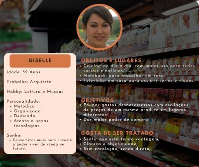

# Informações do Projeto
`TÍTULO DO PROJETO`  

Preço em supermercados

`CURSO` 

Ciência da computação

## Participantes

Os membros do grupo são:

* Henrique Temponi Maia
* Jerson Vitor de Paula Gomes
* João Paulo de Castro Markiewicz
* Lucas Randazzo
* Wallace Freitas Oliveira

# Estrutura do Documento

- [Informações do Projeto](#informações-do-projeto)
  - [Participantes](#participantes)
- [Estrutura do Documento](#estrutura-do-documento)
- [Introdução](#introdução)
  - [Problema](#problema)
  - [Objetivos](#objetivos)
  - [Justificativa](#justificativa)
  - [Público-Alvo](#público-alvo)
- [Especificações do Projeto](#especificações-do-projeto)
  - [Personas e Mapas de Empatia](#personas-e-mapas-de-empatia)
  - [Histórias de Usuários](#histórias-de-usuários)
  - [Requisitos](#requisitos)
    - [Requisitos Funcionais](#requisitos-funcionais)
    - [Requisitos não Funcionais](#requisitos-não-funcionais)
  - [Restrições](#restrições)
- [Projeto de Interface](#projeto-de-interface)
  - [User Flow](#user-flow)
  - [Wireframes](#wireframes)
- [Metodologia](#metodologia)
  - [Divisão de Papéis](#divisão-de-papéis)
  - [Ferramentas](#ferramentas)
  - [Controle de Versão](#controle-de-versão)
- [**############## SPRINT 1 ACABA AQUI #############**](#-sprint-1-acaba-aqui-)
- [Projeto da Solução](#projeto-da-solução)
  - [Tecnologias Utilizadas](#tecnologias-utilizadas)
  - [Arquitetura da solução](#arquitetura-da-solução)
- [Avaliação da Aplicação](#avaliação-da-aplicação)
  - [Plano de Testes](#plano-de-testes)
  - [Ferramentas de Testes (Opcional)](#ferramentas-de-testes-opcional)
  - [Registros de Testes](#registros-de-testes)
- [Referências](#referências)

# Introdução
Imagine-se no seguinte cenário, você acabou de receber o salário e decide ir ao mercado realizar a sua compra mensal, enquanto seleciona os itens de seu carrinho é supreendido por um funcionário alterando o preço de um produto que acaba de pega, tudo certo é uma caracterisca comum do mercado, exceto pelo fato que aquele mesmo item já havia sido remarcado mais cinco vezes naquele dia. Esse cenário hipotético pode parecer absurdo para os mais jovens, no entanto, os que viveram o final da década de 80 se lembram bem.

A hiperinflação brasileira foi um enorme problema político-econômico vivenciado pela população brasileira na década 80, a inflação acumulada já estava na casa do milhões e o poder de compra era reduzido pela metada a cada dia. Uma ida rapida ao mercado era motivo de trauma, já que os preços eram atualizados uma, duas, três ou mais vezes no mesmo dia, tornando os mercados um verdadeiro campo de batalha dos brasileiros em busca de aproveitar as ofertas, afim de garantir ao menos o essencial com o pouco dinheiro que ainda lhe restavam no bolso.

Esse clima de pânico foi substituído pelo alívio de poder saber exatamente o quanto gastaria no mercado, criado após a melhora econômica proporcionada com implementação do Plano Real (1994). No entanto, nos ultimos anos, alguns acontecimentos tem nos levado a relembrar desse período caotico, seja nos protestos de 2014, na greve dos caminhoneiros (2018) e agora mais recente na pandemia da COVID-19 (2020-21) seguida pela alta generalizada dos preços dos combustíveis e commodities agrícolas em consequência da Guerra da Ucrânia.

Esses picos de variação nos preços dos mercados assuta os jovens e trazem o trauma do passado novamente a memória dos que vivenciaram a hiperinflação de 80, levando ambos a temerem o caos e a planejarem melhor seu orçamento, em busca de economizar para o cenário incerto dos próximos anos.

Nesse sentido, a >>equipe<< em seu trabalho busca auxiliar os brasileiros nessa nova demanda orçamentária.     

## Problema

O consumidor brasileiro presenciou nos ultimos anos uma perda consideravel do seu poder de compra. Essa teve como origem diversos fatores políticos e economicos nacionais e internacionais, o que tem levado todos a realizarem mudanças no orçamento e padrão de compra.
Segundo dados do IBGE para o período de 5 anos (2017 - 2022), a inflação acumulada é de 37,5% (JUN/22), e as projeções de mercado para os proximos 3 anos indicam um reajuste de mais 15% (FOCUS 09/22). Todo esse cenário ecônomico aliado ao clima de incertezas ocasionado após a COVID-19 e a questões politicas do ano eleitoral cooperam para que o consumidor brasileiro sinta-se pressionado em uma simples ida ao mercado, tendo de realizar comparações de preços frequentes entre mercados e a retirar itens de menor prioridade de seus carrinhos de compra afim de economizar.

## Objetivos
Em busca de auxilar o brasileiro na nova demanda de realização de compras e a economizar mais. A >>equipe<< visa entregar ao consumidor uma facilitação no momento de saber o preço dos produtos, e os mercados que melhor atenderá suas necessidades naquele instante.
Focando nos seguintes objetivos:

* Desenvolver um Software Web para auxiliar clientes a localizarem produtos mais baratos em mercados.

* Ajudar o consumidor a reduzir as despesas mostrando os melhores preços.

* Conceder visibilidade aos minimercados.

## Justificativa

O que impulsionou esse trabalho foi a instabilidade da economia local e internacional sobre os preços de produtos em 
supermercados apresentando uma ferramenta em modelo web para a melhor busca dos produtos desejados para consumidores 
que desejam controlar melhor suas finanças com base nas nossas pesquisas

## Público-Alvo

......  COLOQUE AQUI O SEU TEXTO ......

> Descreva quem serão as pessoas que usarão a sua aplicação indicando os
> diferentes perfis. O objetivo aqui não é definir quem serão os
> clientes ou quais serão os papéis dos usuários na aplicação. A ideia
> é, dentro do possível, conhecer um pouco mais sobre o perfil dos
> usuários: conhecimentos prévios, relação com a tecnologia, relações
> hierárquicas, etc.
>
> Adicione informações sobre o público-alvo por meio de uma descrição
> textual, ou diagramas de personas, mapa de stakeholders, ou como o
> grupo achar mais conveniente.
> 
> **Links Úteis**:
> - [Público-alvo: o que é, tipos, como definir seu público e exemplos](https://klickpages.com.br/blog/publico-alvo-o-que-e/)
> - [Qual a diferença entre público-alvo e persona?](https://rockcontent.com/blog/diferenca-publico-alvo-e-persona/)
 
# Especificações do Projeto

......  COLOQUE AQUI O SEU TEXTO ......

> Apresente uma visão geral do que será abordado nesta parte do
> documento, enumerando as técnicas e/ou ferramentas utilizadas para
> realizar a especificações do projeto

## Personas e Mapas de Empatia

**MARCIA**

**RUBENS**

**FELIPE**

**GISELLE**

## Histórias de Usuários

Com base na análise das personas forma identificadas as seguintes histórias de usuários:

|EU COMO... `PERSONA`| QUERO/PRECISO ... `FUNCIONALIDADE` |PARA ... `MOTIVO/VALOR`                 |
|--------------------|------------------------------------|----------------------------------------|
|Marcia  | Encontrar os melhores preços em supermercados           | Economizar dinheiro               |
|Marcia | Passar o minimo de tempo fazendo compras | Tomar conta dos filhos |
|Marcia | Saber se um mercado tem determinado produto | Para evitar de ir e perder a viagem |
|Rubens | Ter melhor noção dos preços ao fazer compras                 | Adquirir apartamento proprio |
|Rubens | Poder criar e compartilhar uma lista de compras com a familia  | Manter organizada as compras e saber o que está faltando |
|Felipe | Saber melhores ofertas na região | Conquistar indepêndencia financeira |
|Felipe | Saber a avaliação e distância do mercado | Poder assegurar a qualidade e o tempo que será gasto |
|Giselle | Conseguir ter mais poder de compra | Economizar seu dinheiro para investir |
|Giselle | Saber de ofertas sempre que surgir | Poder aproveitar as ofertas e comprar mais barato |

## Requisitos

As tabelas que se seguem apresentam os requisitos funcionais e não funcionais que detalham o escopo do projeto.

### Requisitos Funcionais

|ID    | Descrição do Requisito  | Prioridade |
|------|-----------------------------------------|----|
|RF-001| Permitir que o usuário cadastre tarefas | ALTA | 
|RF-002| Emitir um relatório de tarefas no mês   | MÉDIA |

### Requisitos não Funcionais

|ID     | Descrição do Requisito  |Prioridade |
|-------|-------------------------|----|
|RNF-001| O sistema deve ser responsivo para rodar em um dispositivos móvel | MÉDIA | 
|RNF-002| Deve processar requisições do usuário em no máximo 3s |  BAIXA | 

> Com base nas Histórias de Usuário, enumere os requisitos da sua
> solução. Classifique esses requisitos em dois grupos:
>
> - [Requisitos Funcionais (RF)](https://pt.wikipedia.org/wiki/Requisito_funcional):
>   correspondem a uma funcionalidade que deve estar presente na
>   plataforma (ex: cadastro de usuário).
>
> - [Requisitos Não Funcionais (RNF)](https://pt.wikipedia.org/wiki/Requisito_n%C3%A3o_funcional):
>   correspondem a uma característica técnica, seja de usabilidade,
>   desempenho, confiabilidade, segurança ou outro (ex: suporte a
>   dispositivos iOS e Android).
>
> Lembre-se que cada requisito deve corresponder à uma e somente uma
> característica alvo da sua solução. Além disso, certifique-se de que
> todos os aspectos capturados nas Histórias de Usuário foram cobertos.
> 
> **Links Úteis**:
> 
> - [O que são Requisitos Funcionais e Requisitos Não Funcionais?](https://codificar.com.br/requisitos-funcionais-nao-funcionais/)
> - [O que são requisitos funcionais e requisitos não funcionais?](https://analisederequisitos.com.br/requisitos-funcionais-e-requisitos-nao-funcionais-o-que-sao/)

## Restrições

O projeto está restrito pelos itens apresentados na tabela a seguir.

|ID| Restrição                                             |
|--|-------------------------------------------------------|
|01| O projeto deverá ser entregue até o final do semestre |
|02| Não pode ser desenvolvido um módulo de backend        |

> Enumere as restrições à sua solução. Lembre-se de que as restrições
> geralmente limitam a solução candidata.
> 
> **Links Úteis**:
> - [O que são Requisitos Funcionais e Requisitos Não Funcionais?](https://codificar.com.br/requisitos-funcionais-nao-funcionais/)
> - [O que são requisitos funcionais e requisitos não funcionais?](https://analisederequisitos.com.br/requisitos-funcionais-e-requisitos-nao-funcionais-o-que-sao/)

# Projeto de Interface

......  COLOQUE AQUI O SEU TEXTO DE INTRODUÇÃO ......

> Apresente as principais interfaces da solução. Discuta como 
> foram elaboradas de forma a atender os requisitos funcionais, não
> funcionais e histórias de usuário abordados nas [Especificações do
> Projeto](#especificações-do-projeto).

## User Flow

......  INCLUA AQUI O DIAGRAMA COM O FLUXO DO USUÁRIO NA APLICAÇÃO ......

> Fluxo de usuário (User Flow) é uma técnica que permite ao desenvolvedor
> mapear todo fluxo de telas do site ou app. Essa técnica funciona
> para alinhar os caminhos e as possíveis ações que o usuário pode
> fazer junto com os membros de sua equipe.
>
> **Links Úteis**:
> - [User Flow: O Quê É e Como Fazer?](https://medium.com/7bits/fluxo-de-usu%C3%A1rio-user-flow-o-que-%C3%A9-como-fazer-79d965872534)
> - [User Flow vs Site Maps](http://designr.com.br/sitemap-e-user-flow-quais-as-diferencas-e-quando-usar-cada-um/)
> - [Top 25 User Flow Tools & Templates for Smooth](https://www.mockplus.com/blog/post/user-flow-tools)
>
> **Exemplo**:
> 
> 

## Wireframes

......  INCLUA AQUI OS WIREFRAMES DAS TELAS DA APLICAÇÃO COM UM BREVE DESCRITIVO ......

> Wireframes são protótipos das telas da aplicação usados em design de interface para sugerir a
> estrutura de um site web e seu relacionamentos entre suas
> páginas. Um wireframe web é uma ilustração semelhante ao
> layout de elementos fundamentais na interface.
> 
> **Links Úteis**:
> - [Ferramentas de Wireframes](https://rockcontent.com/blog/wireframes/)
> - [Figma](https://www.figma.com/)
> - [Adobe XD](https://www.adobe.com/br/products/xd.html#scroll)
> - [MarvelApp](https://marvelapp.com/developers/documentation/tutorials/)
> 
> **Exemplo**:
> 
> 

# Metodologia

......  COLOQUE AQUI O SEU TEXTO ......

> Nesta parte do documento, você deve apresentar a metodologia 
> adotada pelo grupo, descrevendo o processo de trabalho baseado nas metodologias ágeis, 
> a divisão de papéis e tarefas, as ferramentas empregadas e como foi realizada a
> gestão de configuração do projeto via GitHub.
>
> Coloque detalhes sobre o processo de Design Thinking e a implementação do Framework Scrum seguido
> pelo grupo. O grupo poderá fazer uso de ferramentas on-line para acompanhar
> o andamento do projeto, a execução das tarefas e o status de desenvolvimento
> da solução.
> 
> **Links Úteis**:
> - [Tutorial Trello](https://trello.com/b/8AygzjUA/tutorial-trello)
> - [Gestão ágil de projetos com o Trello](https://www.youtube.com/watch?v=1o9BOMAKBRE)
> - [Gerência de projetos - Trello com Scrum](https://www.youtube.com/watch?v=DHLA8X_ujwo)
> - [Tutorial Slack](https://slack.com/intl/en-br/)

## Divisão de Papéis

......  COLOQUE AQUI O SEU TEXTO ......

> Apresente a divisão de papéis e tarefas entre os membros do grupo.
>
> **Links Úteis**:
> - [11 Passos Essenciais para Implantar Scrum no seu Projeto](https://mindmaster.com.br/scrum-11-passos/)
> - [Scrum em 9 minutos](https://www.youtube.com/watch?v=XfvQWnRgxG0)

## Ferramentas

| Ambiente  | Plataforma              |Link de Acesso |
|-----------|-------------------------|---------------|
|Processo de Design Thinkgin  | Miro |  https://miro.com/app/board/uXjVPWa6Bzo=/?share_link_id=631085451992 | 
|Repositório de código | GitHub | https://github.com/ICEI-PUC-Minas-PMGCC-TI/tiaw-pmg-cc-m-20222-01-precos-em-supermercados | 
|Hospedagem do site | - | - | 
|Protótipo Interativo | Figma | - |
|Ferramenta de diagramação | Figma | https://www.figma.com |
|Editor de código | Visual Studio Code | https://code.visualstudio.com/ |
|Ferramenta de comunicação | Whatsapp | https://www.whatsapp.com/ |
|Ferramenta de comunicação | Discord | https://discord.com/ |

O ambiente miro foi escolhido já que foi disponibilizado um template e pela a facilidade de ser
utilizado e pela a capacidade de editar simultanimante. Juntamente com o figma pela a capacidade de edição simultania
e pela a facilidade de criar novas telas. Já o editor de código foi escolhido por todos os membros do grupo
já ter experiencia com a ferramenta e por possuir integração com o sistema de versão.

## Controle de Versão

O projeto segue a seguinte convenção para o nome de branches:

- `master`: Versão testada e estável da pagina web
- `sprint`: Versão para a implementações de melhorias e novas funções
- `dev`: Versão para testes e funcionalidades a serem introduzidas

Sobre à gerência de issues, o projeto adota a seguinte convenção para as etiquetasÇ

- `bugfix`: Funcionalidade com problemas
- `testing`: Teste de funcionalidades

# **############## SPRINT 1 ACABA AQUI #############**

# Projeto da Solução

......  COLOQUE AQUI O SEU TEXTO ......

## Tecnologias Utilizadas

......  COLOQUE AQUI O SEU TEXTO ......

> Descreva aqui qual(is) tecnologias você vai usar para resolver o seu
> problema, ou seja, implementar a sua solução. Liste todas as
> tecnologias envolvidas, linguagens a serem utilizadas, serviços web,
> frameworks, bibliotecas, IDEs de desenvolvimento, e ferramentas.
> Apresente também uma figura explicando como as tecnologias estão
> relacionadas ou como uma interação do usuário com o sistema vai ser
> conduzida, por onde ela passa até retornar uma resposta ao usuário.
> 
> Inclua os diagramas de User Flow, esboços criados pelo grupo
> (stoyboards), além dos protótipos de telas (wireframes). Descreva cada
> item textualmente comentando e complementando o que está apresentado
> nas imagens.

## Arquitetura da solução

......  COLOQUE AQUI O SEU TEXTO E O DIAGRAMA DE ARQUITETURA .......

> Inclua um diagrama da solução e descreva os módulos e as tecnologias
> que fazem parte da solução. Discorra sobre o diagrama.
> 
> **Exemplo do diagrama de Arquitetura**:
> 
> 

# Avaliação da Aplicação

......  COLOQUE AQUI O SEU TEXTO ......

> Apresente os cenários de testes utilizados na realização dos testes da
> sua aplicação. Escolha cenários de testes que demonstrem os requisitos
> sendo satisfeitos.

## Plano de Testes

......  COLOQUE AQUI O SEU TEXTO ......

> Enumere quais cenários de testes foram selecionados para teste. Neste
> tópico o grupo deve detalhar quais funcionalidades avaliadas, o grupo
> de usuários que foi escolhido para participar do teste e as
> ferramentas utilizadas.
> 
> **Links Úteis**:
> - [IBM - Criação e Geração de Planos de Teste](https://www.ibm.com/developerworks/br/local/rational/criacao_geracao_planos_testes_software/index.html)
> - [Práticas e Técnicas de Testes Ágeis](http://assiste.serpro.gov.br/serproagil/Apresenta/slides.pdf)
> -  [Teste de Software: Conceitos e tipos de testes](https://blog.onedaytesting.com.br/teste-de-software/)

## Ferramentas de Testes (Opcional)

......  COLOQUE AQUI O SEU TEXTO ......

> Comente sobre as ferramentas de testes utilizadas.
> 
> **Links Úteis**:
> - [Ferramentas de Test para Java Script](https://geekflare.com/javascript-unit-testing/)
> - [UX Tools](https://uxdesign.cc/ux-user-research-and-user-testing-tools-2d339d379dc7)

## Registros de Testes

......  COLOQUE AQUI O SEU TEXTO ......

> Discorra sobre os resultados do teste. Ressaltando pontos fortes e
> fracos identificados na solução. Comente como o grupo pretende atacar
> esses pontos nas próximas iterações. Apresente as falhas detectadas e
> as melhorias geradas a partir dos resultados obtidos nos testes.

# Referências

......  COLOQUE AQUI O SEU TEXTO ......

> Inclua todas as referências (livros, artigos, sites, etc) utilizados
> no desenvolvimento do trabalho.
> 
> **Links Úteis**:
> - [Formato ABNT](https://www.normastecnicas.com/abnt/trabalhos-academicos/referencias/)
> - [Referências Bibliográficas da ABNT](https://comunidade.rockcontent.com/referencia-bibliografica-abnt/)
